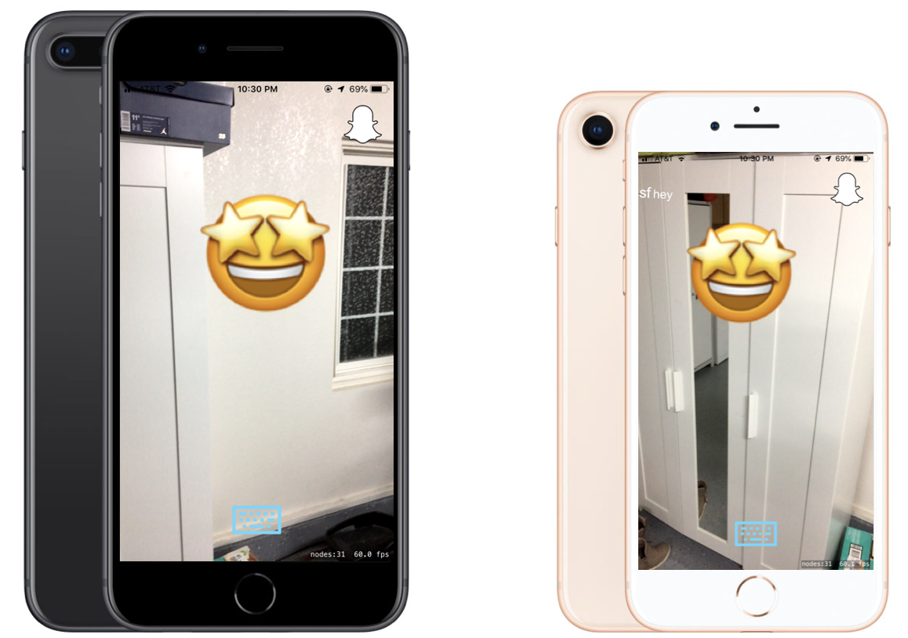

# Stickee - SF Hacks 2019 Project 

## Structure
  -- Google Cloud App Engine--  
  ------ Firebase ------------  
  ------ Node.js server-------  
  ------ Express app --------  
  -- iOS application ---------  
  ------ ARKit ---------------  
  ------ Sprite Kit ----------  
  -- Snapkit -----------------  
  
## Project submission page
https://devpost.com/software/stickee-k9xb6v

## Inspiration

We knew that young people love signing their name like "Jack was here" on the cultural building, especially in Europe. We decided to use modern technologies and suggested API to solve this problem and make the world better.

## What it does

Our application solves the problem of weird signatures on the buildings by moving the whole movement to the AR, where both buildings are not damaged and signatures placed :)

## How we built it

We integrated Google Cloud Platform's Firebase and server into the iOS ARKit application that also used Snapchat API

## Challenges we ran into

1. Linking a domain purchased at domain.com to the App Engine project on Google Cloud 
2. Weird Swift features 
3. Bitmoji API internal errors (even their sample app didn't work) 
4. Xcode configurations and team accounts issues 
5. Putting everything together 
6. Wrong commit 20 minutes before the deadline, the most important button stopped working. We. had to explain its functions with words and could not show it to the judges 
7. ARKit issues: making the signatures stay on the same spot and do not fly away after relaunch or when positioning another device's camera on them.

## Accomplishments that we're proud of

1. We did it! 
2. We all became good friends! 
3. We all gained invaluable experience 
4. Managed to make signatures stay in one place 
5. Connected Google Cloud Platform server with the linked domain name from domain.com, Firebase and integrated it all with Snapchat API 
6. Managed to stay active and passionate even when we couldn't do something 
7. Could find the mutual language between each other, even though worked together as a team for the first time and certainly had some misunderstanding

## What we learned

1. We learned how to use Google Cloud Platform for creating App Engine server using Node.js and Express
2. How to create iOS mobile application
3. How to use Apple's ARKit and SpriteKit
4. Work with device's geolocation
5. Integrate Snapchat API
6. We also learned a lot of Swift features e.g. optionals
7. But most importantly, we learned how to support and help each other as well as how to distribute tasks between the team members and properly handle the given assignments.

## What's next for Stickee

We are planning to work on the ability to post a signature/sticker/text somewhat far from the device (right now the sticker is posted exactly where the gadget is at that moment) as well as the ability to remove the posted stickers. For this, we will need to create a collection of all posted stickers linked to user's Snapchat account.

